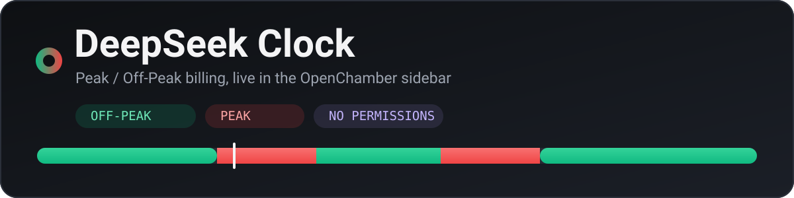
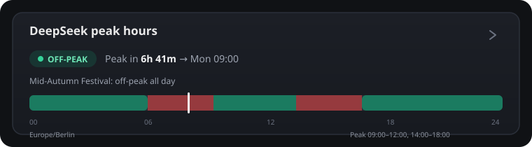

<p align="center">
  
</p>

<p align="center">
  = 2.0.1" />
  
  
  
</p>

<h1 align="center">DeepSeek Clock</h1>

<p align="center">
  <b>See whether DeepSeek bills you at peak or off-peak right now — and exactly when that changes.</b><br/>
  A tiny OpenChamber extension that drops a live billing clock into the chat's <b>Work Status</b> panel.
</p>

---

## ⚡ What it shows

A single section in the right sidebar, next to **Usage**:

<p align="center">
  
</p>

- **`PEAK` / `OFF-PEAK` badge** — the period you are paying right now.
- **Countdown to the next switch** — `Peak in 6h 41m → Mon 09:00`.
- **Why** — `Inside a weekday peak window`, `Weekend: off-peak all day`, or `Mid-Autumn Festival: off-peak all day`.
- **A 24-hour band** — your whole local day with the peak windows painted red and a marker for now.
- **Your time zone** and the local times of both peak windows.

It ticks every second, so the countdown is always live.

## 🧠 Why it exists

DeepSeek charges **two rates** for the same tokens, and off-peak is exactly **half** of peak. If you plan spend — or just want the same request to cost less — the hour you send it matters:

| Rate | Compared to peak |
| --- | --- |
| **Peak** | 1× |
| **Off-peak** | **0.5×** — half price |

This extension makes that hour visible, so you can decide *when* to run a long agent task instead of guessing.

## 🕒 The schedule

DeepSeek publishes the schedule for a Chinese working day:

| | UTC | Beijing (UTC+8) |
| --- | --- | --- |
| **Peak window 1** | `01:00 – 04:00` | `09:00 – 12:00` |
| **Peak window 2** | `06:00 – 10:00` | `14:00 – 18:00` |
| **Off-peak** | everything else | everything else |

- Peak applies **Monday–Friday only**.
- **Weekends** are off-peak all day.
- **Chinese public holidays** are off-peak all day, too.

> Source of truth: [DeepSeek API pricing](https://api-docs.deepseek.com/quick_start/pricing). Prices change; this clock reflects the published *hours*.

## 🖥️ Install

**Requires OpenChamber 2.0.1 or newer.** That release added `contributes.statusSection`, the slot this extension uses. Update first if you are on an older build.

Then open **Settings → Extensions** and add one of:

| Source | How |
| --- | --- |
| **Git URL** | Paste `https://github.com/<you>/deepseek-clock` (supports updates) |
| **ZIP** | Download the repo as a ZIP and pick it |
| **Folder** | Point at a local checkout (handy while developing) |

That's it — **no permission dialog**. The extension asks for nothing: it has no network access, no files, no prompts. It only draws its own section.

Once added, **DeepSeek peak hours** appears in the chat's **Work Status** panel, next to **Usage**. Open the sections dialog there to reorder or hide it.

<details>
<summary>Manual install via the API</summary>

If you cannot use the UI, `POST /api/guests` with `{ "path": "/absolute/path/to/deepseek-clock" }` on your OpenChamber server installs it the same way.

</details>

## 🔍 How it decides

The whole schedule is evaluated in **Beijing time (UTC+8, no DST)**, because that is how DeepSeek defines its working day. A moment is *peak* when all of these hold:

1. The Beijing weekday is **Monday–Friday**, **and**
2. The Beijing date is **not** a Chinese public holiday, **and**
3. The Beijing time falls in `09:00–12:00` or `14:00–18:00`.

Everything else is off-peak. The **next switch** is found by scanning forward from now to the first minute where that answer flips — which naturally skips nights, weekends, and even the nine-day Spring Festival.

## 🌍 Time zones

The clock renders the *result* in the time zone of the machine viewing the panel (your browser's zone), and shows the zone name so there is no ambiguity. A remote OpenChamber server does not change what you see: you always get **your** wall clock.

## 🎌 Holidays

Chinese public holidays for **2026** are hardcoded in [`status/peak.ts`](status/peak.ts) (`CN_HOLIDAYS_2026`), as inclusive Beijing calendar dates:

```ts
{ label: 'Spring Festival', from: '2026-02-15', to: '2026-02-23' },
```

The State Council publishes the next year's arrangement late in the current year, so this list needs a yearly refresh. A holiday that falls on a working day is billed at off-peak rates for the whole day, which is why the list matters.

## 🛠️ Development

```sh
bun add @openchamber/sdk@2.0.1                              # dev dependency, not shipped
bun test status/peak.test.ts                               # schedule logic, 13 cases
bunx openchamber-guest-bundle status/main.ts status/main.js # build the runtime bundle
```

- `bun run test` / `bun run build` are wired as scripts.
- `status/preview.html` is a standalone dark-theme preview of the panel with mock tokens — open it directly, no host needed.
- Install the folder from **Settings → Extensions** while developing; reload the panel after a rebuild.

## 📁 Layout

```
deepseek-clock/
├── package.json          # OpenChamber manifest under "openchamber"
├── status/
│   ├── peak.ts           # pure schedule logic (Beijing math, holidays, next switch)
│   ├── peak.test.ts      # unit tests
│   ├── main.ts           # panel rendering, ticks every second
│   ├── main.js           # built IIFE bundle (committed)
│   ├── index.html        # mount point
│   └── preview.html      # standalone preview
├── assets/               # README artwork
└── README.md
```

OpenChamber serves `status/index.html` + `status/main.js` as-is; there is no build step at install time and no `node_modules` in the shipped package.

## 🚀 Releasing an update

1. Bump `version` in `package.json` (semver).
2. Rebuild: `bunx openchamber-guest-bundle status/main.ts status/main.js`.
3. Commit the **built** `main.js` together with the source, then push.
4. Users who installed from the Git URL see **Update available** in **Settings → Extensions**.

Folder and ZIP installs do not auto-update — replace them by hand.

## ⚠️ Disclaimer

Unofficial and not affiliated with DeepSeek or OpenChamber. It is a read-only clock over publicly documented billing hours; it never touches your API key, balance, or account. Billing hours and prices can change — always confirm against the [official pricing page](https://api-docs.deepseek.com/quick_start/pricing).

## 📄 License

[MIT](LICENSE)
